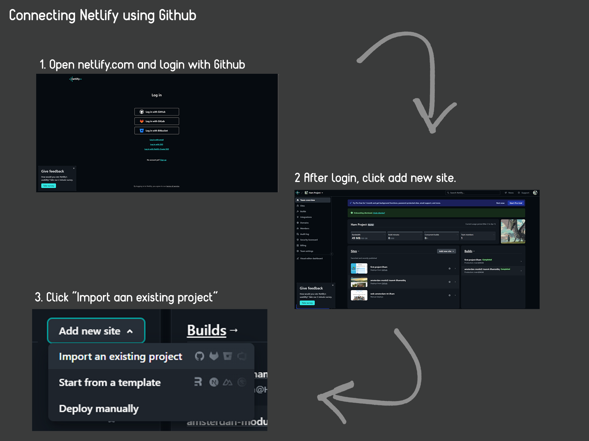

# How Wonderful to Meet You Here ! 👋

HI!! my name Ilham Sidiq, As stated in the title I want. I want to show you. My newest project -- a website with a simple design but looks elegant. in arranging the layout so that it looks neat to make it easier for clients to see and operate this website. chosen of color make yor eye dont tired to see and softt to see the pages. This website offers daily workers who have skills, high responsibility and high quality workers! I hope you like it and can cooperate with our company.

I have a priority to always uphold client satisfaction and continue to adapt to changing trends in the industry. by upholding the company's vision and mission.

## Structure ⏬

- Header
  - Nav Bar
  - Search box
  - Hamburgen button under 1000px
- Main
  - Grid Container
  - Grid Card
  - Project Section
  - Grid Container Two
- Footer
  - Footer Logo
  - Copyright

## Tools Use 🛠️

- HTML (HYPERTEXT MARKUP LANGUAGE)
- CSS (CASCADING STYLE SHEET)
- JAVASCRIPT
- AWESOME FONT FOR ADD DING LOGO.

## Usage Configuration ⚙️

Before that you need to have github acount, if you dont have you can registe here
["Github Register"](https://github.com/).

1. Clone this repository.

```bash
git https://github.com/RevoU-FSSE-4/milestone-1-LightKazuto.git
```

2. You can fork repository, with this link.

```bash
https://github.com/RevoU-FSSE-4/milestone-1-LightKazuto/fork
```

## Deployment 🏬

This website has been deployed using Netlify. You can reach the website by: click this link https://ilhamsidiq.site or [Click this Link](https://ilhamsidiq.site).

1. Connecting your Github to Netlify.

- first step open web netlify, ligin with githu account. after that click add new site and chose import an existing web.
  

- after that click deploy with github, chose repostory do you want to deploy, fill box site name waht do you want, dont forget o check your site name this available or not. and your github has deployed.
  
  <br><br>

2. Automatic deploying using gituhb to netlyfi

- If you have followed the steps above, Netlify will automatically retrieve the
  content contained in the repository that we are using after pushing, although it
  will take some time for the website to redeploy.
  
<br><br>

3. Buying custom domain  on niagahoster and add custom domain on netlify

- firts you need to buy your own custom domain [here](https://auth.niagahoster.co.id/login). and go to domain and buy custom domain what do you like. like me buy [ilhamsidiq.site](https://ilhamsidiq.site). after that verification your email. and last open your DNS / Nameserver in right corner.


- and then open netlify, chose deploy do you want to use custom domain. Open "Set up a custom domain", and add your custon domain to fill box, and berify. next step is open "awaiting external DNS, and set up. after that copy all DNS on pop-up windows.


- Back to your niagahoster click on domain > DNS / nameserve > change nameserver. copy all dns on netlify to fillbox niaga hoster. wait for 1x24 hour till our dns on netlify cheklis. and your custom domain already done.
